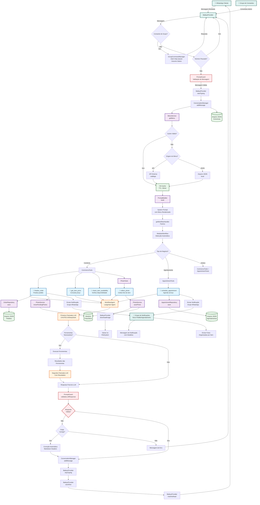

```mermaid
graph TB
    %% Entrada do Sistema
    WhatsApp[📱 WhatsApp Cliente] -->|Mensagem Recebida| Baileys[BaileysProvider]
    GroupWhatsApp[👥 Grupo de Comandos] -->|Comandos Admin| Baileys

    %% Validações Iniciais
    Baileys -->|Mensagem| CommandCheck{Comando de Grupo?}
    CommandCheck -->|Sim| CommandMgr[GroupCommandManager<br/>/start /stop /pause<br/>/resume /status]
    CommandCheck -->|Não| PauseCheck{Número Pausado?}

    CommandMgr -->|Resposta| Baileys
    PauseCheck -->|Sim| Baileys
    PauseCheck -->|Não| Guard1[PromptGuard<br/>Validação de Mensagem]

    %% Processamento Principal
    Guard1 -->|Mensagem Válida| Typing[BaileysProvider<br/>startTyping]
    Typing --> ConvMgr[ConversationManager<br/>addMessage]
    ConvMgr --> MenuSvc[MenuService<br/>getMenu]

    %% Cache e Fontes de Dados
    MenuSvc --> CacheCheck{Cache Válido?}
    CacheCheck -->|Sim| Cache[Hit Cache<br/>TTL: 30min]
    CacheCheck -->|Não| LoadMenu{Origem do Menu?}
    LoadMenu -->|API| API[API Externa<br/>catálogo]
    LoadMenu -->|JSON| JSON[Arquivo JSON<br/>local]
    API --> Cache
    JSON --> Cache

    Cache --> PromptBuilder[PromptBuilder<br/>build]
    PromptBuilder --> SystemPrompt[System Prompt<br/>com Menu Renderizado]

    %% Workflow e Ferramentas
    SystemPrompt --> WorkflowFactory[getWorkflowHandler<br/>Factory]
    WorkflowFactory --> ModularWorkflow[ModularWorkflow<br/>Detecção Automática]

    ModularWorkflow --> TypeCheck{Tipo de Negócio?}
    TypeCheck -->|Comércio| CommerceTools[CommerceTools]
    TypeCheck -->|Agendamento| AppointmentTools[AppointmentTools]
    TypeCheck -->|Ambos| BothTools[CommerceTools +<br/>AppointmentTools]

    %% Ferramentas de Comércio
    CommerceTools --> FinalizeOrder[🔧 finalize_order<br/>Finaliza pedido]
    CommerceTools --> GetPrice[🔧 get_item_price<br/>Consulta preço]
    CommerceTools --> CheckAvail[🔧 check_item_availability<br/>Verifica disponibilidade]
    CommerceTools --> PhotoTools[PhotoTools]

    %% Ferramentas de Foto
    PhotoTools --> CollectPhoto[🔧 collect_photo<br/>Coleta foto do item]

    %% Ferramentas de Agendamento
    AppointmentTools --> ScheduleAppt[🔧 schedule_appointment<br/>Agenda serviço]

    %% Agente Langchain - Fluxo de Decisão
    FinalizeOrder --> WorkflowAgent[WorkflowAgent<br/>Langchain Agent]
    GetPrice --> WorkflowAgent
    CheckAvail --> WorkflowAgent
    CollectPhoto --> WorkflowAgent
    ScheduleAppt --> WorkflowAgent

    WorkflowAgent --> LLMCall1[Primeira Chamada LLM<br/>CHUTES.AI/DeepSeek]
    LLMCall1 --> ToolDecision{Ferramentas<br/>Necessárias?}

    ToolDecision -->|Sim| ToolExec[Executa Ferramentas]
    ToolExec --> ToolResults[Resultados das Ferramentas]
    ToolResults --> LLMCall2[Segunda Chamada LLM<br/>Com Resultados]
    LLMCall2 --> LLMResponse[Resposta Final do LLM]

    ToolDecision -->|Não| LLMResponse

    %% Serviços de Suporte às Ferramentas
    FinalizeOrder --> OrderRepo[OrderRepository<br/>save]
    FinalizeOrder --> PhotoService2[PhotoService<br/>movePendingPhotos]
    FinalizeOrder --> Notification1[Enviar Notificação<br/>Grupo WhatsApp]

    CollectPhoto --> PhotoService1[PhotoService<br/>savePhoto]
    PhotoService1 --> DownloadImg[BaileysProvider<br/>downloadImage]
    DownloadImg --> SaveFS[Salvar no<br/>FileSystem]

    ScheduleAppt --> ApptRepo[AppointmentRepository<br/>save]
    ScheduleAppt --> Notification2[Enviar Notificação<br/>Grupo WhatsApp]

    %% Validação de Resposta
    LLMResponse --> Guard2[PromptGuard<br/>validateLLMResponse]
    Guard2 --> ValidationCheck{Resposta<br/>Válida?}
    ValidationCheck -->|Não| CorrectCheck{Pode<br/>Corrigir?}
    CorrectCheck -->|Sim| Corrected[Correção Automática<br/>Markdown Headers]
    CorrectCheck -->|Não| ErrorMsg[Mensagem de Erro]
    ValidationCheck -->|Sim| SaveResponse[ConversationManager<br/>addMessage]

    Corrected --> SaveResponse
    ErrorMsg --> Baileys

    %% Envio Final
    SaveResponse --> StopTyping[BaileysProvider<br/>stopTyping]
    StopTyping --> SendText[BaileysProvider<br/>sendText]
    SendText --> MarkRead[BaileysProvider<br/>markAsRead]
    MarkRead --> WhatsApp

    %% Notificações
    Notification1 --> NotificationGroup[📢 Grupo de Notificações<br/>Novo Pedido/Agendamento]
    Notification2 --> NotificationGroup
    NotificationGroup --> SendNotifMsg[Mensagem de Notificação<br/>com Detalhes]
    NotificationGroup --> SendPhotos[Enviar Fotos<br/>Organizadas por Item]

    %% Repositórios e Persistência
    OrderRepo --> OrderFile[(Arquivo JSON<br/>Pedidos)]
    ApptRepo --> ApptFile[(Arquivo JSON<br/>Agendamentos)]
    ConvMgr --> ConvFile[(Arquivo JSON<br/>Conversas)]
    PhotoService1 --> PhotoDir[(Diretório<br/>Fotos/Itens)]
    PhotoService2 --> PhotoDir

    %% Estilos
    classDef tool fill:#e1f5ff,stroke:#01579b,stroke-width:2px
    classDef service fill:#f3e5f5,stroke:#4a148c,stroke-width:2px
    classDef agent fill:#fff3e0,stroke:#e65100,stroke-width:2px
    classDef storage fill:#e8f5e9,stroke:#1b5e20,stroke-width:2px
    classDef validation fill:#ffebee,stroke:#b71c1c,stroke-width:2px
    classDef communication fill:#e0f2f1,stroke:#004d40,stroke-width:2px

    class FinalizeOrder,GetPrice,CheckAvail,CollectPhoto,ScheduleAppt tool
    class MenuSvc,PhotoService1,PhotoService2,PhotoTools,PromptBuilder,OrderRepo,ApptRepo service
    class WorkflowAgent,LLMCall1,LLMCall2 agent
    class OrderFile,ApptFile,ConvFile,PhotoDir,Cache storage
    class Guard1,Guard2,ValidationCheck validation
    class Baileys,WhatsApp,GroupWhatsApp,NotificationGroup communication
```
