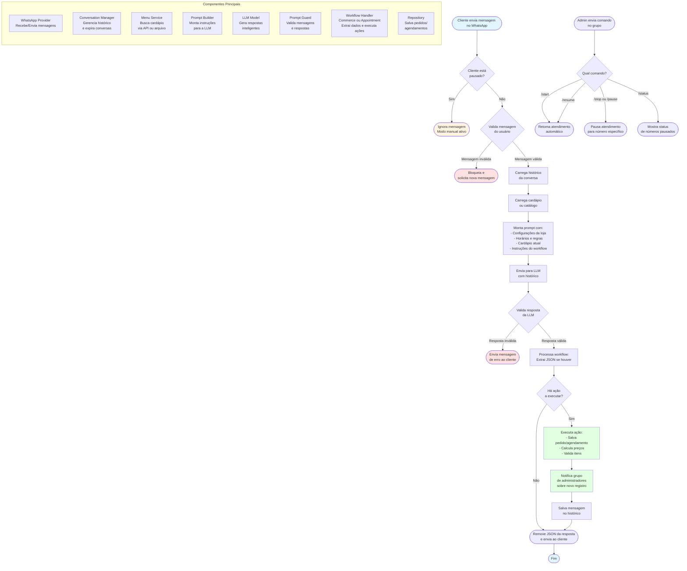

```mermaid
flowchart TD
    Start([Cliente envia mensagem no WhatsApp]) --> CheckPause{Cliente está<br/>pausado?}

    CheckPause -->|Sim| Ignore([Ignora mensagem<br/>Modo manual ativo])
    CheckPause -->|Não| ValidateUser{Valida mensagem<br/>do usuário}

    ValidateUser -->|Mensagem inválida| Block([Bloqueia e<br/>solicita nova mensagem])
    ValidateUser -->|Mensagem válida| LoadState[Carrega histórico<br/>da conversa]

    LoadState --> LoadMenu[Carrega cardápio<br/>ou catálogo]
    LoadMenu --> BuildPrompt[Monta prompt com:<br/>- Configurações da loja<br/>- Horários e regras<br/>- Cardápio atual<br/>- Instruções do workflow]

    BuildPrompt --> CallLLM[Envia para LLM<br/>com histórico]
    CallLLM --> ValidateLLM{Valida resposta<br/>da LLM}

    ValidateLLM -->|Resposta inválida| ErrorResponse([Envia mensagem<br/>de erro ao cliente])
    ValidateLLM -->|Resposta válida| ProcessWorkflow[Processa workflow:<br/>Extrai JSON se houver]

    ProcessWorkflow --> CheckAction{Há ação<br/>a executar?}

    CheckAction -->|Não| SendResponse([Remove JSON da resposta<br/>e envia ao cliente])
    CheckAction -->|Sim| ExecuteAction[Executa ação:<br/>- Salva pedido/agendamento<br/>- Calcula preços<br/>- Valida itens]

    ExecuteAction --> NotifyGroup[Notifica grupo<br/>de administradores<br/>sobre novo registro]
    NotifyGroup --> SaveMessage[Salva mensagem<br/>no histórico]
    SaveMessage --> SendResponse

    SendResponse --> End([Fim])

    %% Fluxo paralelo de comandos de grupo
    GroupCommand([Admin envia comando<br/>no grupo]) --> ParseCommand{Qual comando?}
    ParseCommand -->|/start| Resume([Retoma atendimento<br/>automático])
    ParseCommand -->|/stop ou /pause| Pause([Pausa atendimento<br/>para número específico])
    ParseCommand -->|/resume| Resume
    ParseCommand -->|/status| ShowStatus([Mostra status<br/>de números pausados])

    %% Componentes principais
    subgraph "Componentes Principais"
        direction TB
        WhatsApp[WhatsApp Provider<br/>Recebe/Envia mensagens]
        ConversationMgr[Conversation Manager<br/>Gerencia histórico<br/>e expira conversas]
        MenuSvc[Menu Service<br/>Busca cardápio<br/>via API ou arquivo]
        PromptBuilder[Prompt Builder<br/>Monta instruções<br/>para a LLM]
        LLM[LLM Model<br/>Gera respostas<br/>inteligentes]
        Guard[Prompt Guard<br/>Valida mensagens<br/>e respostas]
        Workflow[Workflow Handler<br/>Commerce ou Appointment<br/>Extrai dados e executa ações]
        Repository[Repository<br/>Salva pedidos/<br/>agendamentos]
    end

    style Start fill:#e1f5ff
    style End fill:#e1f5ff
    style Ignore fill:#fff4e1
    style Block fill:#ffe1e1
    style ErrorResponse fill:#ffe1e1
    style ExecuteAction fill:#e1ffe1
    style NotifyGroup fill:#e1ffe1
```
